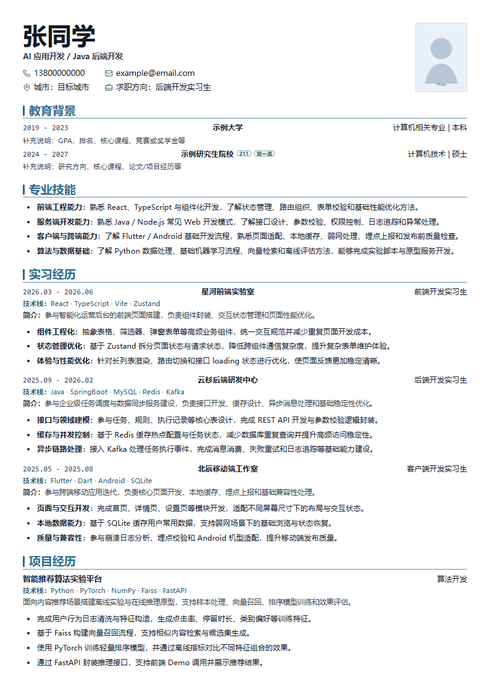

# Resume Studio

A client-side resume editor built with React, TypeScript, and Vite.

Live demo: https://powau3.github.io/resume-studio/

## Preview

Only anonymized demo data is included in this repository. Personal resume data, imported JSON, exported PDFs, and private screenshots must stay local and must not be committed.



## Run locally

```bash
npm install
npm run dev
```

## Checks

```bash
npm run privacy:check
npm run build
npm run lint
```

## Privacy

The app runs in the browser and stores editing data locally. The repository is guarded by a privacy check in local git hooks and GitHub Actions. To block your own private terms locally, add them to `.privacy-denylist.local`; that file is ignored by git.
